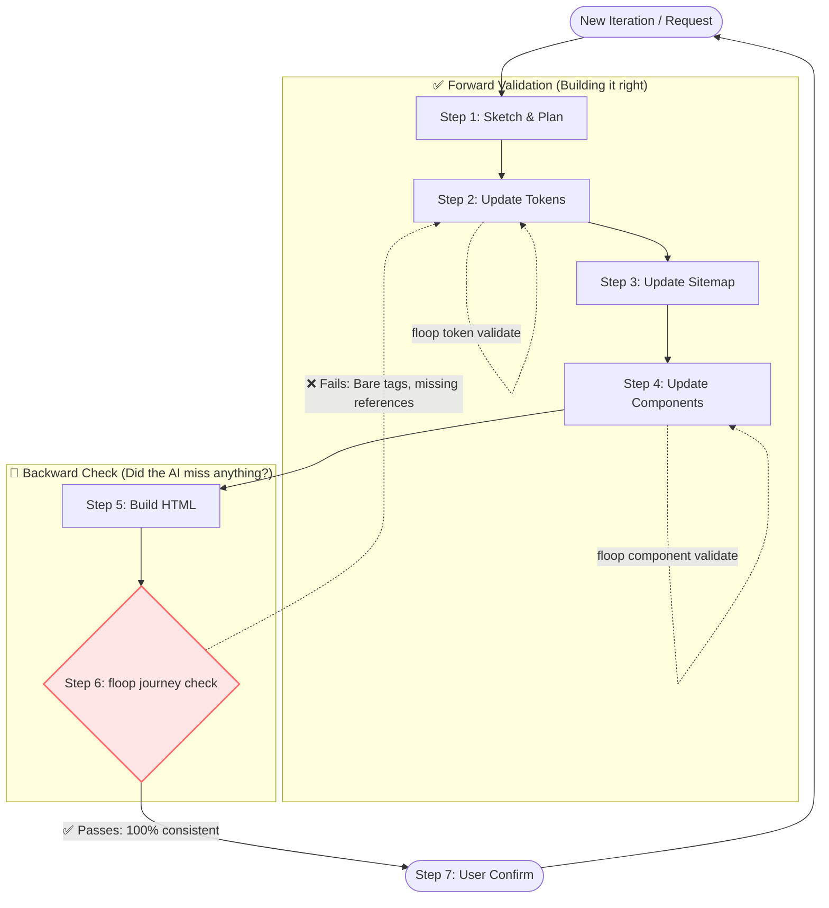

# floop

**AI prototypes degrade with every iteration. floop is the missing quality loop that keeps your Agent honest. An open-source alternative to Figma Make and Google Stitch.**

[](https://pypi.org/project/floop/)
[](https://pypi.org/project/floop/)
[](LICENSE)
[](#supported-agents)
[](#)

---

## The Problem: The "Disposable Prototype" Trap

Building a UI with AI (Cursor, Claude, Copilot) always starts out feeling like magic. But as you iterate, that magic quickly turns into a mess. 

Because AI lacks design discipline, it hallucinates new colors, forgets your component library, and injects messy inline styles. What you hoped would be a maintainable project becomes a **disposable prototype**—a tangled codebase that you'll inevitably have to throw away and rewrite from scratch.

**Why does this happen?** AI is perfectly optimized to generate code *forward*, but has zero ability to enforce consistency *backward*. It's exactly like writing code without tests: it works on day one, but silently degrades with every new feature.

```text
WITHOUT floop

  Iteration 1:  "Build a login page"  → looks perfect ✓
  Iteration 3:  "Add a dashboard"     → hallucinates new shades of blue, adds inline CSS
  Iteration 5:  "Add settings page"   → forgets components entirely, writes raw HTML
  Iteration 8:  "Change brand color"  → updates 2 files, misses 6 others
  Iteration 10: "Add onboarding"      → unmaintainable Frankenstein codebase

  Result: The AI only generated forward. No one caught the regressions.
```

```text
WITH floop

  Iteration 1:  "Build a login page"  → tokens.css + components.js, validated ✓
  Iteration 3:  "Add a dashboard"     → perfectly reuses the exact same tokens and components ✓
  Iteration 5:  "Add settings page"   → floop catches raw tags, forces agent to rewrite them ✓
  Iteration 8:  "Change brand color"  → update one token, rebuild — all 8 pages sync ✓
  Iteration 10: "Add onboarding"      → pristine consistency, production-ready ✓

  Result: The quality loop catches what the AI misses. Every page, every iteration.
```

---

## What floop Does

floop forces your AI to stop writing free-form, disposable HTML and start building a structured, reusable design system. It overrides the AI's default "just generate" behavior by locking it into a strict, backward-checked workflow.

Instead of generating page layouts immediately, the AI must explicitly define design tokens and components first. Then, floop acts as your project's quality gate, catching regressions (like bare HTML tags or hallucinatory colors) when the AI inevitably tries to cut corners.



---

## Why floop

### For Individuals (Makers & Founders)
> AI delivers infinite speed, but **you** need sustainable assets.

AI accelerates your imagination, but if you don't enforce discipline, you end up with an unmaintainable toy. floop acts as your automated safety net, ensuring your fast prototypes remain structurally sound, preventing technical debt from forcing a complete rewrite.

### For Teams (Designers & Developers)
> Real projects run on design systems, not inline styles.

AI-generated code is notoriously hard to hand off because it relies on hallucinated DOM structures and hardcoded colors. By enforcing W3C DTCG tokens and a strict component YAML, floop guarantees the AI outputs developer-ready `tokens.css` and `components.js` that seamlessly merge into real production codebases.


---

## Use Cases

### Scenario 1: The Global Redesign
**Problem:** "Make all the primary buttons slightly rounder, and change the brand color to purple." The AI updates the homepage perfectly, but forgets the dashboard, settings, and login pages.

**floop Solution:** The AI is instructed to update the `global.tokens.json`. You run `floop build`. Every single page across the entire project updates instantly with mathematical consistency. No manual sweeping required.

### Scenario 2: The Multi-Page Hallucination
**Problem:** When you ask the AI to build a list view for page 2, it invents a totally new card style with hardcoded `border-radius: 8px` and `#333` hex colors.

**floop Solution:** The AI is strictly bound by `.floop/components.yaml`. When it attempts to build page 2, `floop journey check` detects the bare `<div>` tags and inline styles. The check fails, and the agent is forced to rewrite the page using the registered `DataCard` component or fail the build.

### Scenario 3: Handoff to Engineering
**Problem:** Developers refuse to touch AI prototypes because they're a tangled mess of arbitrary class names and unmaintainable inline styles.

**floop Solution:** Because floop enforced standard `tokens.css` and documented `components.js` from day one, engineers can drop these exact artifacts directly into their React/Vue/Tailwind design systems. It's production-ready CSS architecture from the start.


---

## Features

- **Design System Tokens**: Manage brand variables using the W3C DTCG format (global → semantic → component).
- **Structured Prototypes**: Compose layouts through defined components, domain logic, and journey maps.
- **Multiple Platform Preview**: Inspect your UI seamlessly across Web, Tablet, and Mobile device shells.
- **Code-Level Output**: Automatically compile design concepts into developer-friendly `tokens.css` and `components.js`.
- **Multi-Version Snapshots**: Save named iterations (v1, v2) and easily compare or roll back versions in the local preview.

### Highlights: The Quality Mechanisms

To keep the AI in check, floop enforces a structured workflow combining manual confirmation with two automated quality gates.

- **🫂 Human in the Loop**: The AI never commits blindly. Every iteration pauses for your explicit review and confirmation.
- **✅ Forward Validate**: Verifies tokens and components format and cross-references *before* the AI is allowed to build the page layout (`floop token validate`).
- **🔁 Backward Check**: Scans the generated HTML to catch bare DOM tags, hallucinated inline CSS, or missing token references *after* the page is built (`floop journey check`).

### Supported Agents

| Agent | Command |
|-------|---------|
| GitHub Copilot | `floop enable copilot` |
| Cursor | `floop enable cursor` |
| Claude Code | `floop enable claude` |
| Trae IDE | `floop enable trae` |
| Qwen Code | `floop enable qwen-code` |
| OpenCode | `floop enable opencode` |
| OpenClaw | `floop enable openclaw` |

---

## Installation

```bash
pip install floop
```

Verify:

```bash
floop --version
```

---

## Quick Start

```bash
# 1. Initialize project
cd your-project
floop init

# 2. Install skills into your AI agent
floop enable copilot     # or: cursor, claude, trae, qwen-code, opencode, openclaw

# 3. Prompt your AI Agent
# Just tell it what you want to build (e.g., "Build a SaaS dashboard").
# The installed floop skill will take over and guide it step-by-step.

# 4. Preview the result
floop preview
# Opens http://localhost:<port>
```

---

## For Contributors

Because floop is fundamentally a tool focused on **Agent Engineering**, we welcome contributors looking to expand the toolkit of supported Agents or harden the validation mechanics of the CLI! 

### Getting Started

```bash
# 1. Fork and clone the repository
git clone https://github.com/<your-username>/floop.git
cd floop/floop-cli

# 2. Install inside a virtual environment for development
pip install -e ".[test]"

# 3. Run the test suite (floop maintains 100% coverage)
pytest tests/

# 4. Want to add a new AI Agent to `floop enable`?
# Add yours directly in: src/floop/skills.py
```

---

## Star History

[](https://star-history.com/#marvintalk/floop&Date)

---

## License

This project is licensed under the [Apache License 2.0](LICENSE).
