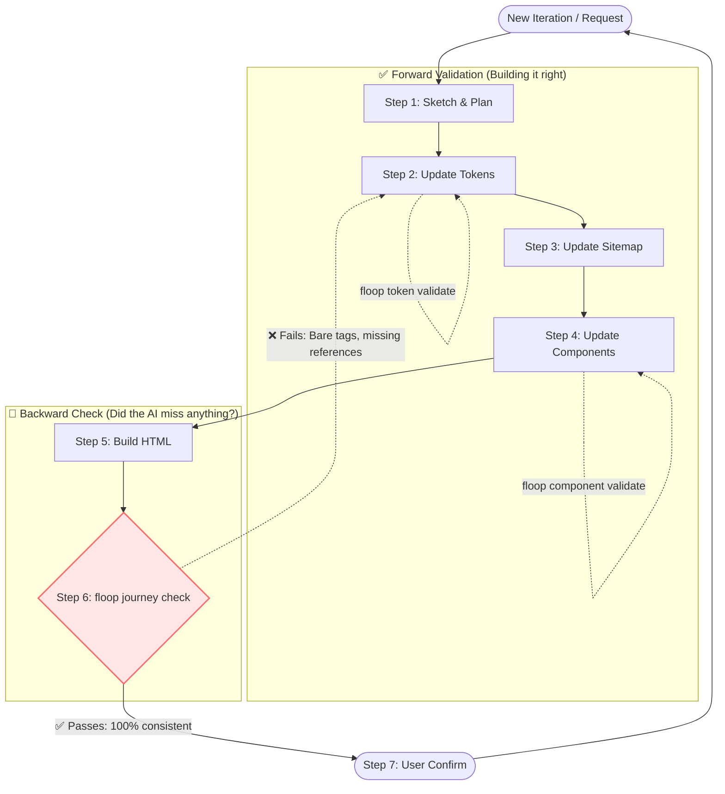

# floop

**AI prototypes degrade with every iteration. floop is the missing quality loop that keeps your Agent honest. An open-source alternative to Figma Make and Google Stitch.**

---

## The Problem: The "Disposable Prototype" Trap

Building a UI with AI (Cursor, Claude, Copilot) always starts out feeling like magic. But as you iterate, that magic quickly turns into a mess. 

Because AI lacks design discipline, it hallucinates new colors, forgets your component library, and injects messy inline styles. What you hoped would be a maintainable project becomes a **disposable prototype**—a tangled codebase that you'll inevitably have to throw away and rewrite from scratch.

**Why does this happen?** AI is perfectly optimized to generate code *forward*, but has zero ability to enforce consistency *backward*. It's exactly like writing code without tests: it works on day one, but silently degrades with every new feature.

```text
WITHOUT floop

  Iteration 1:  "Build a login page"  → looks perfect ✓
  Iteration 3:  "Add a dashboard"     → hallucinates new shades of blue, adds inline CSS
  Iteration 5:  "Add settings page"   → forgets components entirely, writes raw HTML
  Iteration 8:  "Change brand color"  → updates 2 files, misses 6 others
  Iteration 10: "Add onboarding"      → unmaintainable Frankenstein codebase

  Result: The AI only generated forward. No one caught the regressions.
```

```text
WITH floop

  Iteration 1:  "Build a login page"  → tokens.css + components.js, validated ✓
  Iteration 3:  "Add a dashboard"     → perfectly reuses the exact same tokens and components ✓
  Iteration 5:  "Add settings page"   → floop catches raw tags, forces agent to rewrite them ✓
  Iteration 8:  "Change brand color"  → update one token, rebuild — all 8 pages sync ✓
  Iteration 10: "Add onboarding"      → pristine consistency, production-ready ✓

  Result: The quality loop catches what the AI misses. Every page, every iteration.
```

---

## What floop Does

floop forces your AI to stop writing free-form, disposable HTML and start building a structured, reusable design system. It overrides the AI's default "just generate" behavior by locking it into a strict, backward-checked workflow.

Instead of generating page layouts immediately, the AI must explicitly define design tokens and components first. Then, floop acts as your project's quality gate, catching regressions (like bare HTML tags or hallucinatory colors) when the AI inevitably tries to cut corners.



---

## Why floop

### For Individuals (Makers & Founders)
> AI delivers infinite speed, but **you** need sustainable assets.

AI accelerates your imagination, but if you don't enforce discipline, you end up with an unmaintainable toy. floop acts as your automated safety net, ensuring your fast prototypes remain structurally sound, preventing technical debt from forcing a complete rewrite.

### For Teams (Designers & Developers)
> Real projects run on design systems, not inline styles.

AI-generated code is notoriously hard to hand off because it relies on hallucinated DOM structures and hardcoded colors. By enforcing W3C DTCG tokens and a strict component YAML, floop guarantees the AI outputs developer-ready `tokens.css` and `components.js` that seamlessly merge into real production codebases.
